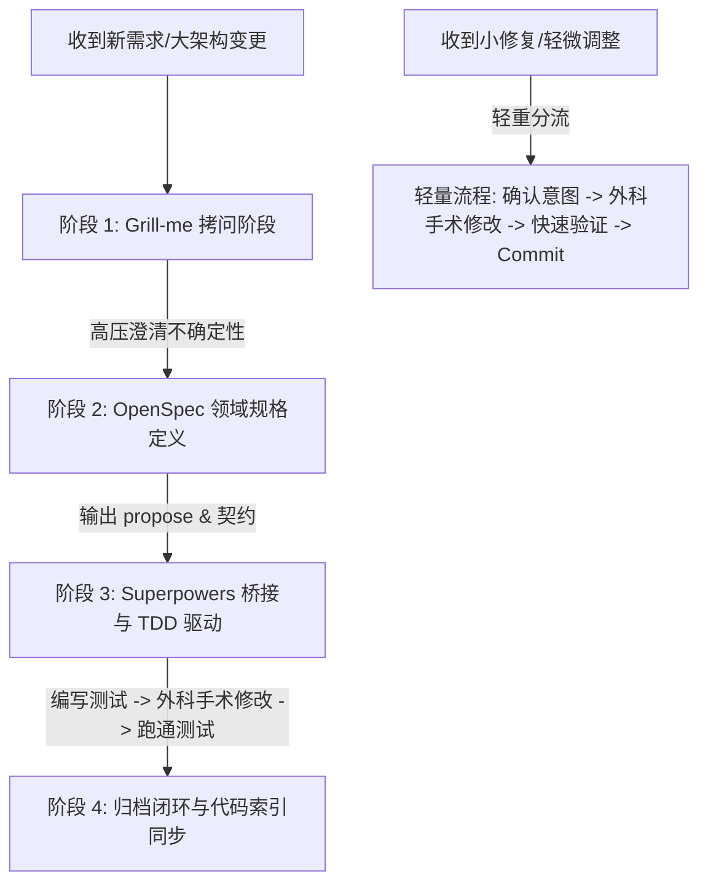

# 任务部署说明书：在空白 Git 项目中搭建全栈工程师 Agent 架构与开发闭环

> **任务目标**：你需要在新的空白 Git 项目中，基于 Trae AI IDE 建立一套面向“全栈工程师”的 AI Agent 协作规范与工具链。该体系必须打通需求拷问（grill-me）、领域级规格定义（OpenSpec）、工程级落地与 TDD 驱动（Superpowers），并集成代码索引 MCP（`code-viewer-graph`），同时建立“轻重分流机制”，既保障核心架构演进的严谨性，又确保日常小修小补的轻量敏捷。

---

## 1. 业务背景与设计理念

在传统研发流程中，需求分析、工程规格定义、代码实现与测试验证常存在严重断层。AI 编程时代（从 Vibe Coding 走向 Harness Engineering / Loop 范式），我们需要通过工具与规范将 AI 锁死在工程纪律之中：

1. **需求拷问（grill-me）**：在动笔写代码/规格前，通过多轮高压审问，挖出所有隐含假设与边缘场景。
2. **规格定义（OpenSpec）**：输出领域级的规范文档（propose），完成架构与契约的严密设计。
3. **工程落地与 TDD 闭环（Superpowers）**：将领域级 OpenSpec 产物转换为工程级的代码改动设计（Design/Spec），并以测试驱动开发（TDD）方式完成代码编写与归档闭环。
4. **轻重分流（Featherweight vs. Heavyweight）**：区分“架构/核心变更”与“小修复/轻量调整”，避免过度工程化导致开发沉重。

---

## 2. 工具链选择与选择性引入原则（Skill & Rule Matrix）

**严禁全量搬运与无脑全量引入**。需要根据实际开发场景，裁剪并引入绝对必要的规则与技能：

| 类别              | 工具/Skill/Rule 名称                                                               | 来源与版本                                | 引入目的/作用                                                                                                    |
| :---------------- | :--------------------------------------------------------------------------------- | :---------------------------------------- | :--------------------------------------------------------------------------------------------------------------- |
| **Rules**   | `.trae/rules/AGENTS.md` (或 `AGENTS.md`)                                       | 团队全局规范                              | 建立身份感知、诚实底线、外科手术式修改、编码决策阶梯、测试守底线纪律，**并直接定义轻重任务分流判定分支**。 |
| **MCP**     |  **[code-review-graph](https://github.com/tirth8205/code-review-graph)** | Trae MCP 配置 (`mcp.json`)              | 提供本地 AST 与代码符号关联图谱索引，为 AI 提供上下文定位支持。                                                  |
| **Skill 1** | `grill-with-docs` / `grill-me`                                                 | 核心 Skill (`.trae/skills/grill-me`)    | **需求澄清卡口**。在 propose 前逼问不确定性，消除假设。                                                    |
| **Skill 2** | `openspec` / `spec-dev`                                                        | 核心 Skill (`.trae/skills/openspec`)    | **领域规格定义**。输出标准的 `propose` 方案与契约文件。                                                  |
| **Skill 3** | `tdd-superpowers`                                                                | 核心 Skill (`.trae/skills/superpowers`) | **工程级 TDD 驱动**。桥接 OpenSpec 输出，拆解测试用例、驱动绿灯并完成归档闭环。                            |

---

## 3. 全栈工程师 Agent 完整开发流程

标准的重度开发流程分为 **4 个卡口阶段**：

### 阶段 1：Grill-me 拷问阶段 (Requirement Clarification)

- **触发标准**：涉及新功能、领域模型变更或跨模块重构。
- **动作**：AI 针对需求进行高压逼问（覆盖异常边界、并发、数据一致性、历史兼容）。
- **产物**：无歧义的《需求约束清单》。

### 阶段 2：OpenSpec 领域规格定义 (Domain Spec Propose)

- **触发标准**：Grill 结束，确认需求边界。
- **动作**：使用 OpenSpec 规范生成 `propose.md`，定义领域契约（API/数据结构/模块边界）。
- **产物**：`openspec/proposals/<feature_id>/propose.md`。

### 阶段 3：Superpowers 工程桥接与 TDD 驱动 (TDD Execution)

- **动作**：
  1. **桥接转化**：解析 `propose.md`，将其转换为工程级单元测试与集成测试计划（RED）。
  2. **TDD 循环**：先写测试用例断言失败 (RED) -> 外科手术式编写最少实现代码 -> 测试通过 (GREEN) -> 重构 (REFACTOR)。
- **产物**：通过所有测试的代码与测试用例文件。

### 阶段 4：归档闭环与索引同步 (Archiving & Code Graph Sync)

- **动作**：更新功能文档，标记 Proposal 已完成，触发 `code-viewer-graph` 更新 AST 代码索引。

---

## 4. 需求/问题的“轻重分流机制”

为防止“小题大做”，项目必须硬性规定分流标准：

### 4.1 评估维度与分类标准

| 维度               | 轻量级任务 (Lightweight Flow)                           | 重度级任务 (Heavyweight Flow)                     |
| :----------------- | :------------------------------------------------------ | :------------------------------------------------ |
| **影响范围** | 仅单文件修改、单纯 UI 样式微调、文案修改、注释补充      | 涉及多模块交互、DB 表结构变动、对外接口契约变更   |
| **逻辑风险** | 不改变任何业务核心断言与底层流程                        | 包含核心状态机跳转、权限校验、金流/数据一致性逻辑 |
| **代码量**   | 估计改动行数`< 30 行`                                 | 估计改动行数`≥ 30 行`                          |
| **典型场景** | 文案修正、修样式 padding/margin、补日志、简单 Null 保护 | 新增 API 接口、重构支付逻辑、修改全局中间件       |

### 4.2 轻量级任务执行流 (Lightweight Protocol)

1. **直接定位**：利用 `code-viewer-graph` 获取目标代码符号节点。
2. **意图确认**：在对话框中一句话申明修改意图与评估范围。
3. **外科手术式修改**：仅修改目标代码段，严格禁止“顺手重构”。
4. **即刻验证**：运行现有相关单测或本地简易验证，确认无破坏后直接 Commit。

---

## 5. 员工执行 CheckList (步骤与交付要求)

你作为执行员工，需要在空白 Git 项目中按照以下步骤完成落地：

- [ ] **Step 1: 初始化项目结构**
  - 创建 `.trae/rules/AGENTS.md`（配置团队全局纪律、编码决策阶梯与分流规则）。
  - 创建 `.trae/mcp.json`（配置 `code-viewer-graph` 或相关 AST 分析工具）。
- [ ] **Step 2: 选择性引入 Skill & 编写规则路由**
  - 在 `.trae/skills/` 中精简引入 `grill-me`（需求拷问）、`openspec`（领域规格输出）、`superpowers`（TDD 驱动与工程桥接）。
  - 在 `.trae/rules/AGENTS.md` 中写入分流决策判定逻辑（无需创建独立的 `light-fix` Skill，保持简约）。
- [ ] **Step 3: 运行一次完整 Mock 演练**
  - **重度演练**：模拟新增一个业务功能，完成 `Grill -> OpenSpec -> Superpowers (TDD) -> Archiving` 闭环。
  - **轻量演练**：模拟修改一个文案/样式，直接走轻量流程完成 commit。
- [ ] **Step 4: 提交项目 Readme 与开发 SOP 规范**
  - 在新项目根目录下输出 `README.md` 与 `DEVELOPMENT_SOP.md`，明确团队日常开发流程。
