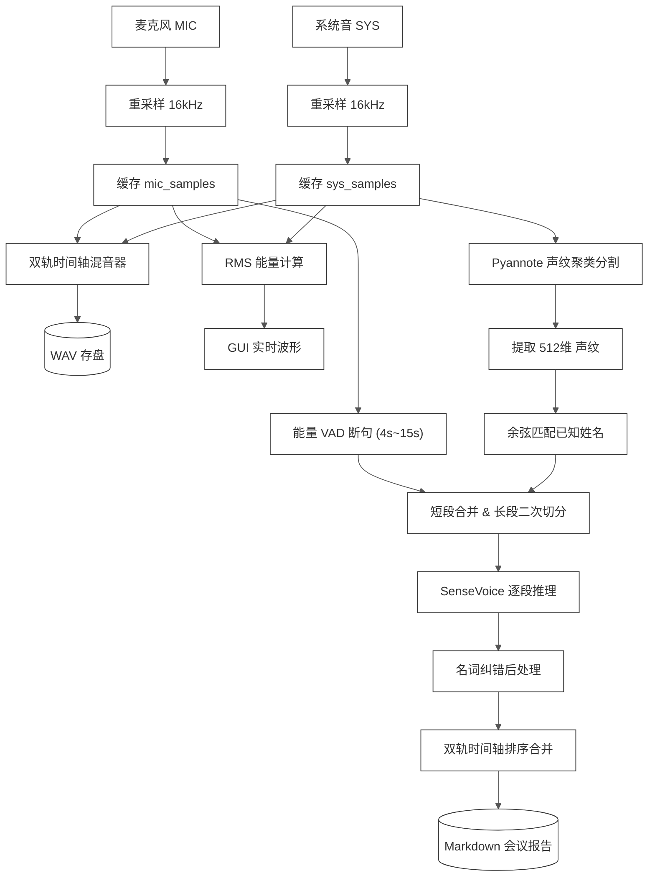
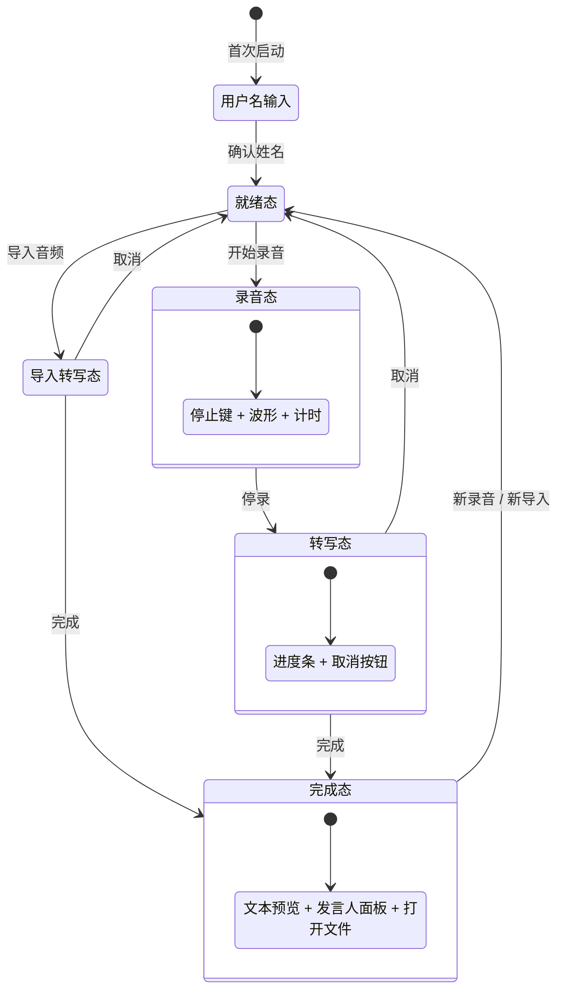

# 离线会议转写工具 — 开发任务说明书

> **任务类型**：从零实现完整桌面应用
> **难度评级**：⭐⭐⭐⭐（高级）
> **预估工期**：3 个工作日
> **交付物**：可双击运行的跨平台桌面应用 + 配套构建/打包脚本
> **ASR 模型指定**：SenseVoice（FunAudioLLM 离线语音识别模型）

---

## 一、工期拆解与估算依据 (WBS)

本任务预估 **3 个工作日**（基于 AI 协作开发与明确的需求规格，无需做算法选型试错），具体拆解如下：

| 阶段            | 核心任务模块                             | 预估工期 | 估算依据与开发重点                                                                                                          |
| :-------------- | :--------------------------------------- | :------: | :-------------------------------------------------------------------------------------------------------------------------- |
| **Day 1** | **音频采集与 SenseVoice 推理管线** |  1.0 天  | 实现麦克风+WASAPI系统音捕获、16kHz 重采样、双轨混音落盘；集成 SenseVoice 离线推理与模型异步加载                             |
| **Day 2** | **VAD、声纹聚类与合并**            |  1.0 天  | 实现麦克风轨能量 VAD 断句；实现系统音轨 Pyannote 聚类分割、512维声纹提取与余弦匹配，完成双轨时间轴排序合并与原子写 Markdown |
| **Day 3** | **桌面 GUI、小窗模式与打包**       |  1.0 天  | 完成主界面、录音小窗置顶模式、设置面板（包含发言人命名与名词映射）；编写下载脚本与 Windows 打包脚本，完成联调测试           |

---

## 二、产品定位与核心理念

### 2.1 一句话描述

一款**纯离线**的双轨会议转写桌面工具——同时录制麦克风和系统音频，停录后自动识别说话人角色并转写为分角色 Markdown 会议纪要。**全程脱网，数据不出本机**。

### 2.2 核心设计原则

| 编号 | 原则                     | 含义                                                                                                                            |
| :--: | :----------------------- | :------------------------------------------------------------------------------------------------------------------------------ |
|  P1  | **离线是隐私契约** | 应用 GUI 运行时**严禁发起任何网络请求**。所有模型必须在打包时内置或开发态预先缓存，运行时缺模型直接报错，绝不静默联网下载 |
|  P2  | **录音零开销**     | 录音期间只做音频采集 + 混音存盘 + 实时波形显示，**不做任何 AI 推理**。所有 ASR / 声纹分析在停录后离线执行                 |
|  P3  | **录音与转写解耦** | 录音线程不依赖模型是否加载完成——模型未就绪时也能先录，停录后模型加载完成自动续转                                              |
|  P4  | **数据安全**       | 声纹库、配置文件的写入须采用原子写（先写临时文件再 rename），避免写盘中途崩溃导致数据损坏                                       |

---

## 三、功能需求清单

### 3.1 音频采集（双轨录音）

| 需求编号 | 需求描述                     | 验收标准                                                                                                          |
| :------: | :--------------------------- | :---------------------------------------------------------------------------------------------------------------- |
|   A-1   | 支持选择麦克风设备录音       | GUI 下拉列表枚举系统所有可用输入设备，用户可选择                                                                  |
|   A-2   | 支持捕获系统音频（对方声音） | Windows 通过 WASAPI 系统回环捕获；架构上预留跨平台扩展能力（macOS 可通过虚拟音频设备，Linux 可通过 Monitor 设备） |
|   A-3   | 双轨时间轴对齐混音           | 麦克风 + 系统音频在时间轴上对齐，混合后写入单个 WAV 文件（16kHz / 16bit / 单声道）                                |
|   A-4   | 各轨独立缓存                 | 录音期间麦克风和系统音频的原始 PCM 数据分别缓存在内存中，停录后分别送入各自的分析管线                             |
|   A-5   | 硬件采样率自适应             | 无论设备原生采样率多少（44.1kHz / 48kHz 等），自动重采样到 16kHz                                                  |
|   A-6   | 多声道转单声道               | 多声道设备自动取各声道平均转为单声道                                                                              |
|   A-7   | 系统音混音衰减               | 混音时系统音轨适度衰减（建议 0.9），避免盖过本端人声                                                              |

### 3.2 语音识别（ASR）

| 需求编号 | 需求描述                           | 验收标准                                                                                        |
| :------: | :--------------------------------- | :---------------------------------------------------------------------------------------------- |
|   B-1   | 使用 SenseVoice 模型做离线语音识别 | 集成 SenseVoice（支持中文为主，英文/日文为辅）的本地推理能力                                    |
|   B-2   | 支持多语言识别                     | 至少支持中文、英文、日文、自动识别四种模式                                                      |
|   B-3   | 分段推理                           | 不对整段长音频直接推理——麦克风轨经 VAD 断句后逐段送入 ASR，系统音轨经声纹分割后逐段送入 ASR   |
|   B-4   | 静音段跳过                         | 段内峰值过低（接近静音）的片段跳过 ASR，节省算力                                                |
|   B-5   | 推理线程数可配                     | 用户可在 GUI 中调整推理线程数（1-8），系统给出推荐值（CPU 核数 / 2，上限 4）                    |
|   B-6   | 模型异步加载                       | 模型加载放在后台线程，不阻塞 GUI 渲染；加载期间显示"正在加载推理引擎"                           |
|   B-7   | ASR 输出清洗                       | 清除模型输出中可能夹带的 special token 标签（语言标记、情绪标记、XML 控制标签等），只保留纯文本 |

### 3.3 声纹分析与说话人识别

| 需求编号 | 需求描述         | 验收标准                                                                                         |
| :------: | :--------------- | :----------------------------------------------------------------------------------------------- |
|   C-1   | 系统音轨声纹聚类 | 系统音频通过说话人分割模型（如 Pyannote 等）自动聚类为多个 Speaker 区间                          |
|   C-2   | 声纹特征提取     | 为每个聚类出的 Speaker 提取声纹特征向量（如 512 维）                                             |
|   C-3   | 本地声纹记忆库   | 应用维护一个本地声纹数据库（如`~/.<appname>/speakers.json`），存储已注册发言人的姓名和声纹特征 |
|   C-4   | 声纹余弦匹配     | 转写时将本场提取的声纹与本地库做余弦相似度匹配（建议阈值 0.65），超过阈值则自动标注已知姓名      |
|   C-5   | 新声纹注册       | 转写完成后，用户可在 GUI 中为本场检测到的未知发言人命名并注册到声纹库，下次会议自动识别          |
|   C-6   | 声纹库管理       | GUI 中可查看已注册声纹列表并逐个删除                                                             |
|   C-7   | 声纹库版本化     | 持久化格式包含版本号字段，便于未来模型升级时做数据迁移                                           |
|   C-8   | 损坏容错         | 声纹库文件解析失败时自动备份原文件，以空库继续运行，不崩溃                                       |

### 3.4 能量 VAD（语音活动检测）

| 需求编号 | 需求描述             | 验收标准                                                                                 |
| :------: | :------------------- | :--------------------------------------------------------------------------------------- |
|   D-1   | 麦克风轨 VAD 断句    | 基于 RMS 能量的轻量 VAD：按固定块大小计算 RMS，连续多块低于阈值判定为静音并断句          |
|   D-2   | 段长约束             | 最短语音段 ≥ 4s（避免超短段送 ASR），最长 ≤ 15s（强制切断，防单段过长导致模型退化）    |
|   D-3   | 系统音轨二次分段保护 | 声纹聚类的某些段可能很长（说话人连续说几分钟），需对 > 15s 的段做二次 VAD 切分后再送 ASR |
|   D-4   | 相邻短段合并         | 同角色相邻段间隔 ≤ 1.5s 且累计 ≤ 15s 的可合并为一段，避免语气词被切成碎句              |

### 3.5 转写管线与报告输出

| 需求编号 | 需求描述             | 验收标准                                                                                                                                   |
| :------: | :------------------- | :----------------------------------------------------------------------------------------------------------------------------------------- |
|   E-1   | 双轨按时间合并       | 麦克风轨（标"我"）和系统音轨（标角色名）的转写结果按时间戳排序合并                                                                         |
|   E-2   | 分角色 Markdown 报告 | 含报告标题、生成日期与按时间戳排序的正文；行格式`[MM:SS] 角色名 文本`（麦克风轨标"我 (姓名)"，其余发言人标角色名）。详见下文报告格式示例 |
|   E-3   | 名词纠错后处理       | 支持用户配置「错词=正确词」映射表（逗号分隔），转写完成后自动全文替换                                                                      |
|   E-4   | 报告原子写           | 先写`.tmp` 再 rename，避免崩溃留半截文件                                                                                                 |
|   E-5   | 转写进度反馈         | 转写过程中 GUI 显示百分比进度条 + spinner 动画                                                                                             |
|   E-6   | 可取消转写           | 转写进行中用户可取消，取消后静默回到就绪态                                                                                                 |
|   E-7   | 报告格式单一真相源   | 报告格式化逻辑只写在一处，GUI 渲染、首次生成、重命名重写全部复用同一函数                                                                   |

**报告格式示例**（对应 E-2）：

```text
# 会议转写报告
生成日期: 2026-08-04

[00:12] 我 (张三) 今天先同步一下进度
[00:18] 发言人1 那部分我来负责
[00:35] 我 (张三) 好，下周复盘
```

> 麦克风轨固定标"我 (姓名)"；系统音轨/导入音频的发言人，未注册声纹时标"发言人N"，注册后标真实姓名。

### 3.6 导入已有音频转写

| 需求编号 | 需求描述          | 验收标准                                                                  |
| :------: | :---------------- | :------------------------------------------------------------------------ |
|   F-1   | 导入外部音频文件  | 支持导入 WAV / M4A / MP3 / AAC / FLAC 等常见格式                          |
|   F-2   | 自动解码 + 重采样 | 任意采样率、任意编解码格式自动解码为 16kHz 单声道 f32 PCM                 |
|   F-3   | 统一走声纹聚类    | 导入音频视为一场多人混合录音，统一走声纹聚类分角色（无 mic/sys 物理分离） |
|   F-4   | 模型未就绪时挂起  | 导入时若模型未加载完成，挂起任务，模型就绪后自动续转                      |

### 3.7 GUI 界面

| 需求编号 | 需求描述             | 验收标准                                                                                                                           |
| :------: | :------------------- | :--------------------------------------------------------------------------------------------------------------------------------- |
|   G-1   | 桌面 GUI 应用        | 跨平台原生桌面应用（macOS / Windows / Linux）                                                                                      |
|   G-2   | 首次启动用户名强拦截 | 首次打开必须输入使用者姓名才能进入主界面（用于标记"我"）                                                                           |
|   G-3   | 主界面——录音态     | 显示：开始/停止录音按钮、双轨实时波形（麦克风 + 系统音）、录音时长计时                                                             |
|   G-4   | 主界面——转写态     | 显示：转写进度百分比 + spinner、取消按钮；禁用录音按钮防误操作                                                                     |
|   G-5   | 主界面——完成态     | 显示：转写文本预览、"打开文件"按钮（在系统文件管理器中定位输出目录）                                                               |
|   G-6   | 录音小窗模式         | 开始录音后自动缩为屏幕右上角置顶小窗（仅停止键 + 波形），停录/转写后恢复完整窗口                                                   |
|   G-7   | 设置页面             | 分 Tab 设置：常规（姓名、语言、输出目录、推理线程数）、音频（麦克风选择、系统音开关）、高级纠错（名词映射）、声纹管理（注册/删除） |
|   G-8   | 多语言界面           | 界面至少支持中文、英文、日文三种语言，自动检测系统语言                                                                             |
|   G-9   | 配置持久化           | 所有用户设置（姓名、语言、设备选择、线程数、输出目录等）保存到本地配置文件，下次启动自动恢复                                       |
|   G-10   | CJK 字体支持         | 跨平台加载系统中文字体，彻底解决 CJK 乱码问题                                                                                      |
|   G-11   | 导入音频按钮         | 主界面提供"导入音频转写"按钮，弹出文件选择对话框                                                                                   |
|   G-12   | 会议发言人面板       | 转写完成后左栏显示本场检测到的发言人列表，可为每个人命名/改名并注册声纹                                                            |
|   G-13   | 改名即时生效         | 给发言人改名后立即刷新转写文本和 MD 文件（支持多次重命名）                                                                         |
|   G-14   | 模型状态指示         | 主界面显示推理引擎就绪/加载中/错误状态，错误时提供重试按钮                                                                         |

### 3.8 命令行模式（可选加分项）

| 需求编号 | 需求描述                                                                    | 验收标准                                                             |
| :------: | :-------------------------------------------------------------------------- | :------------------------------------------------------------------- |
|   H-1   | `--list-devices`                                                          | 列出所有可用音频输入设备                                             |
|   H-2   | `--offline <音频文件> [--name <名>] [--lang zh\|en\|ja\|auto] [--threads N]` | 对已有音频文件离线走完整转写管线（VAD/聚类/ASR），输出 Markdown 报告 |
|   H-3   | `--help`                                                                  | 显示帮助信息                                                         |

---

## 四、非功能需求

### 4.1 隐私与安全

- GUI 运行时**零网络请求**（可通过抓包/防火墙验证）
- 声纹数据、录音文件、转写文本全部留在本机
- 配置文件和声纹库采用原子写，防数据丢失

### 4.2 性能

- 录音期间 GUI 不卡顿（录音线程与 GUI 线程分离）
- 波形 RMS 更新频率 ≤ 50ms（节流，不堆积）
- 双轨混音单路失衡超 5s 时做防 OOM 处理（直写出去而非无限堆积）

### 4.3 平台支持

- **主开发平台：Windows**（首要交付目标）
- Windows 系统音频走 WASAPI Loopback
- 打包脚本（Windows 分发包）自动将模型内置
- 架构设计上预留跨平台扩展能力（音频采集、文件路径、系统字体等做平台抽象），便于后续移植到 macOS / Linux

### 4.4 模型管理

- 提供独立的模型下载脚本（非 GUI 内置），支持代理、镜像回退
- 打包脚本检测模型缓存缺失时自动调用下载脚本
- 模型默认缓存路径：`~/.<appname>/models/`
- 运行时模型定位优先级：exe 同级 `./models/` → 用户 Home `~/.<appname>/models/`

### 4.5 仓库与开源

- 项目以 **GitHub 公开仓库** 形式开发与交付。
- **必须包含开源 License**（建议 MIT 或同等宽松协议），无 License 的公开仓库法律上等同于"保留所有权利"，他人无法合规使用。
- **严禁提交敏感数据**：声纹库（个人生物特征）、录音文件、转写报告、使用者真实姓名、本地绝对路径等一律 `.gitignore` 排除——声纹误推公开仓库即隐私事故，且一旦推送公开历史，单纯删除无法从 fork/缓存中彻底消除。
- **模型文件不入库**：单体常达数百 MB~GB，须通过独立下载脚本获取并在 README 注明，不直接 commit（必要时用 Git LFS）。
- 仓库 README 含完整构建与使用说明。

---

## 五、数据路径约定

> 下表路径中的 `<appname>` 为应用数据根目录名占位（位于用户主目录 `~/` 下，形如 `~/.<appname>/`），具体名称由最终应用名确定；本文档其他章节出现的 `<appname>` 同义。

| 数据       | 路径                                                   | 说明                      |
| :--------- | :----------------------------------------------------- | :------------------------ |
| 模型缓存   | `~/.<appname>/models/`                               | 开发态预下载 / 打包时内置 |
| 用户配置   | `~/.<appname>/config.json`                           | 持久化所有 GUI 设置       |
| 声纹数据库 | `~/.<appname>/speakers.json`                         | 原子写，带版本号          |
| 录音文件   | `<用户选择的输出目录>/record_YYYYMMDD_HHMMSS.wav`    | 混音后的 WAV              |
| 转写报告   | `<用户选择的输出目录>/transcript_YYYYMMDD_HHMMSS.md` | 分角色 Markdown           |

---

## 六、转写管线数据流



---

## 七、GUI 界面状态机



---

## 八、验收标准

### 8.1 基础验收（必须通过）

- [ ] 应用能在 Windows 上双击启动，无外部依赖
- [ ] 首次启动强制要求输入使用者姓名
- [ ] 能选择麦克风并开始录音，录音期间显示实时波形
- [ ] 停录后自动进入离线转写，显示进度，完成后输出 Markdown 报告
- [ ] 报告中麦克风轨标记为"我 (姓名)"，系统音轨按声纹聚类标记为不同发言人
- [ ] 能注册声纹到本地库，下次会议自动识别已知人声
- [ ] 全程抓包验证零网络请求（GUI 运行期间）
- [ ] 配置和声纹数据重启后不丢失

### 8.2 进阶验收（体现工程质量）

- [ ] 录音态自动切换小窗模式
- [ ] 名词纠错映射生效
- [ ] 导入外部音频文件（M4A / MP3）能正确转写
- [ ] 声纹库文件损坏时自动备份并以空库继续
- [ ] 转写可取消，取消后不残留错误状态
- [ ] 录音期间模型可以还在加载，停录后模型就绪自动续转
- [ ] 命令行 `--offline` 模式可对已有 WAV 重跑转写

### 8.3 代码质量要求

- [ ] 录音线程与转写线程完全解耦（不共享可变状态）
- [ ] 报告格式化逻辑不重复（单一真相源）
- [ ] 文件写入全部使用原子写
- [ ] 有基本的单元测试覆盖核心逻辑（VAD 分段、名词纠错、声纹匹配等）
- [ ] 代码有清晰的模块划分和注释

---

## 九、交付物清单

| 序号 | 交付物           | 说明                                                                      |
| :--: | :--------------- | :------------------------------------------------------------------------ |
|  1  | 应用源代码       | 完整可编译的项目，含 README                                               |
|  2  | 模型下载脚本     | 独立脚本，支持代理和镜像回退                                              |
|  3  | Windows 打包脚本 | 输出分发压缩包，模型内置                                                  |
|  4  | 用户使用说明     | README 中包含安装、配置、使用方式                                         |
|  5  | 公开仓库与开源   | GitHub 公开仓库，含 License、`.gitignore`（排除敏感数据与模型）、README |

## 十、参考信息

### 10.1 ASR 模型（SenseVoice）

- 模型：SenseVoice-Small（FunAudioLLM 开源，中文为主，兼具多语言 / 情感 / 声学事件识别）
- 官方仓库：https://github.com/FunAudioLLM/SenseVoice
- 离线推理框架：推荐 sherpa-onnx（加载 ONNX 格式模型，纯本地、跨平台、离线打包友好）；亦支持其他 ONNX 运行时
- 模型缓存路径与命名见 §五

### 10.2 声纹分割参考

- Pyannote（说话人分割）
- 3D-Speaker / ECAPA-TDNN（声纹特征提取）
- 可选用 sherpa-onnx 等推理框架统一管理模型

### 10.3 系统音频捕获参考

- Windows：WASAPI Loopback（系统原生支持，首要实现目标）
- macOS（扩展）：BlackHole 虚拟音频设备
- Linux（扩展）：PulseAudio Monitor 设备

---

## 十一、延伸课题：与 FunASR 工具包的对比研究

本任务的 ASR / 分割 / 声纹选定 **SenseVoice + Pyannote + 3D-Speaker** 三个模型组件（推荐经 sherpa-onnx 加载 ONNX），属于「分组件拼装」路线。**FunASR**（阿里达摩院 ModelScope 团队开源的语音识别**工具包**）则是另一条值得对比研究的一体化路线——它把 ASR（含 SenseVoice / Paraformer 等模型）、VAD（FSMN-VAD）、说话人分离（CAM++）、标点预测打包成一条 Python pipeline，`from funasr import AutoModel` 即可组装。

建议对比维度：

- **模型同源性**：两条路线底层模型高度重叠（SenseVoice 同名；本任务的 3D-Speaker 与 FunASR 内置的 CAM++ 同源）
- **工程形态**：分组件 ONNX（sherpa-onnx，跨语言、桌面打包友好）vs Python 全家桶（funasr，依赖重、离线分发难）
- **VAD 方案**：自研能量 VAD + Pyannote 分割 vs FunASR 内置 FSMN-VAD
- **性能**：同模型下的准确率 / 速度 / 资源占用实测差异
- **离线契约与跨平台分发**：对本工具「纯离线 + 跨平台打包」目标的适配度

> FunASR 工具包仓库：https://github.com/modelscope/FunASR ，提供 pip / Docker / OpenAI 兼容 API 等多种部署形态，详见其官方文档。

---

> **注意**：本文档描述的是产品行为与功能规格。ASR / 分割 / 声纹指定具体模型组件，推理框架与编程语言保留选型弹性（推荐 sherpa-onnx），鼓励实现前对比不同方案的 ROI。
